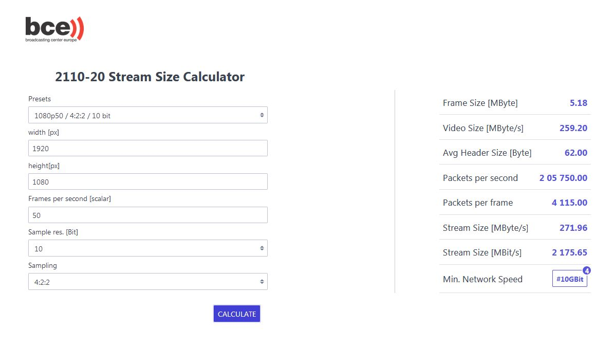

# StreamSizeCalculator

This is a tool to calculate network requirements for streaming 2110-20 video.
After first tests, this tool seem to have an accuracy of 99,8 percent. It only works for BPM (Blocked Packing Mode)

## Usage
To use this tool, simply download the zip or clone this directory and open the index.html with your browser.

## Third party
The tool uses local copies of [jQuery](https://jquery.com/) for convenient DOM mainpulation and [Spectre.css](https://picturepan2.github.io/spectre/index.html) for the look.

## Info
This tool was developed during an internship at the Broadcasting Center Europe [BCE](https://www.bce.lu/) by me, Fabian Schöttler. The application is free software and published under a BSD3 License. Copyright holder: Broadcasting Center Europe
